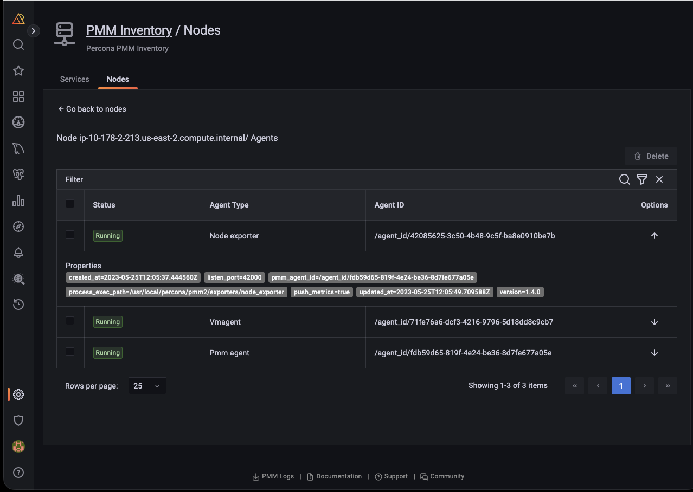
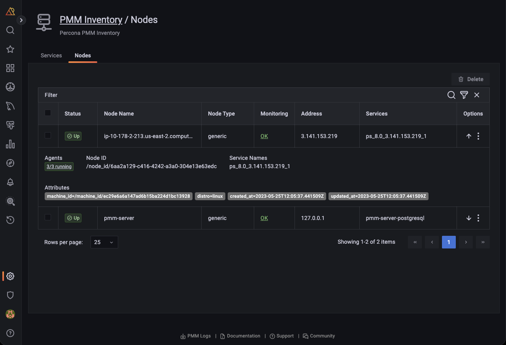

# Percona Monitoring and Management 2.38.0

| **Release date:** | JUn 02, 2023                                                                                    |
| ----------------- | ----------------------------------------------------------------------------------------------- |
| **Installation:** | [Installing Percona Monitoring and Management](https://www.percona.com/software/pmm/quickstart) |

Percona Monitoring and Management (PMM) is an open source database monitoring, management, and observability solution for MySQL, PostgreSQL, and MongoDB.

<!---
!!! caution alert alert-warning "Important/Caution"
    Crucial points that need emphasis:

    - Important: A significant point that deserves emphasis.
    - Caution: Used to mean 'Continue with care'.
 --->

## Release Highlights

### Improved nodes view on the Inventory page

In our constant endeavor to enhance user experience, we further improved the **Inventory** page by improving the **Nodes** tab. With this change, you can get more context on your inventory objects, such as node, and more actionable information for exploring and resolving possible issues.

Here is the change as part of PMM 2.38.0:

- You can see the number of agents running on any particular node. When you click on any node, the UI navigates to the view of agents, which is filtered to display only agents related to that specific node. 

    

- You can also view comprehensive information about each agent, including key attributes such as node type, IP address, and associated services. This gives you a complete overview of the nodes at a glance.

    

- You can check the health status of the agents to see if they are running or have failed.

### MongoDB backup enhancements

#### Sharded cluster backup support
This release introduces support for working with backups for sharded clusters. PMM handles the backup process end-to-end, but restoring such artifacts is currently possible only via the CLI, using Percona Backup for MongoDB.

For information on restoring sharded backups, check the [PBM documentation](https://docs.percona.com/percona-backup-mongodb/usage/restore.html)

#### Better folder management for enhanced PMB compatibility 
We’ve added a new **Folder** field to the Create Backup pages. Use this to specify a specific target directory within the selected local or S3-compatible location for the backup.  

Organizing backups in folders makes grouping PBM backups for clusters easier, and it improves PMM-PBM integration workflows. For example, it enables you to switch between the PBM CLI and PMM UI when creating backups, or add snapshots to running PITR backups.

The **Folder** field is automatically populated with the value of the cluster label. You can change this default folder from PMM’s Advanced Settings. However,  this is not recommended since it can…

## Components upgrade

## New Features

- [PMM-2852](https://jira.percona.com/browse/PMM-2852) - [MySQL, PostgreSQL] QAN support for parsing query comments
- [PMM-11961](https://jira.percona.com/browse/PMM-11961) - Node related Agents
- [PMM-11962](https://jira.percona.com/browse/PMM-11962) - Filtering for Services and Nodes in Inventory
- [PMM-12077](https://jira.percona.com/browse/PMM-12077) - Telemetry data about the base image
- [PMM-12087](https://jira.percona.com/browse/PMM-12087) - Inventory - add tooltip to status columns
- [PMM-12156](https://jira.percona.com/browse/PMM-12156) - Add EL9 to Jenkins pipelines

## Improvements

- [PMM-4466](https://jira.percona.com/browse/PMM-4466) - Migrate Grafana from using SQLite to PostgreSQL
- [PMM-6279](https://jira.percona.com/browse/PMM-6279) - Query metadata not visible in new UI
- [PMM-9367](https://jira.percona.com/browse/PMM-9367) - MongoDB Backup: Sharded Cluster Backup
- [PMM-11250](https://jira.percona.com/browse/PMM-11250) - Allow user to specify target directory for backup artifact
- [PMM-11537](https://jira.percona.com/browse/PMM-11537) - DBaaS: Explain Internet Facing check box
- [PMM-11746](https://jira.percona.com/browse/11746) - `Top innoDB I/O Data Writes` panel misleading
- [PMM-12038](https://jira.percona.com/browse/PMM-12038) - MongoDB backups don't work if authentication mechanism other than SCRAM is used
- [PMM-12089](https://jira.percona.com/browse/PMM-12089) - Sort Inventory tables by Service and Node name
- [PMM-12109](https://jira.percona.com/browse/PMM-12109) - [Docs] Mongo backup prerequisites miss mongod in PATH requirement
- [PMM-12114](https://jira.percona.com/browse/PMM-12114) - Grafana upgrade to 9.2.18 due to CVE
- [PMM-12136](https://jira.percona.com/browse/PMM-12136) - Shift to El9 as default base image for PMM-Server

## Bugs Fixed

 - [PMM-7438](https://jira.percona.com/browse/PMM-7438) - Users unable to download troubleshooting logs from PMM
- [PMM-9224](https://jira.percona.com/browse/PMM-9224) - Arbiter does not show up MongoDB ReplSet Summary dashboard
- [PMM-9541](https://jira.percona.com/browse/PMM-9541) - PostgreSQL exporter not working with --socket
- [PMM-9544](https://jira.percona.com/browse/PMM-9544) - Alerting doesn't seem to be able to monitor for "Host Down"
- [PMM-9673](https://jira.percona.com/browse/PMM-9673) - Latest version 2.26.0 errors with 500 errors
- [PMM-9844](https://jira.percona.com/browse/PMM-9844) - PMM screen wrap
- [PMM-10799](https://jira.percona.com/browse/PMM-10799) - PMM table aliased - QAN doesnt show any tables
- [PMM-11386](https://jira.percona.com/browse/PMM-11386) - MongoDB QAN query time metrics is showing wrong unit, should be ms
- [PMM-11632](https://jira.percona.com/browse/PMM-11632)  - rds_exporter ignores DisableEnhancedMetrics
- [PMM-11692](https://jira.percona.com/browse/PMM-11692)  - `Top MySQL Active Client Threads` panel misleading
- [PMM-11715](https://jira.percona.com/browse/PMM-11715)  - CPU Utilization Graph for RDS instances is not marching what cloudwatch reports
- [PMM-11938](https://jira.percona.com/browse/PMM-11938)  - PMM client continuously tries to create pg_stat_montior_settings view.
- [PMM-11950](https://jira.percona.com/browse/PMM-11950)  - Non-admin roles are calling restricted endpoints after login or page refresh.
- [PMM-11970](https://jira.percona.com/browse/PMM-11970)  - [telemetry] ui-events being lost when send to pmm-manageds fails
- [PMM-12024](https://jira.percona.com/browse/PMM-12024)  - QAN agent can't start due to the unexpected return value type
- [PMM-12031](https://jira.percona.com/browse/PMM-12031)  - Inventory: Flags "enhanced_metrics_disabled" and "basic_metrics_disabled" are not displayed.
- [PMM-12067](https://jira.percona.com/browse/PMM-12067)  - QAN: Vulnerability in vitess package.
- [PMM-12085](https://jira.percona.com/browse/PMM-12085)  - SSH Access to AMI & OVF images for el9 based images doesn't work
- [PMM-12091](https://jira.percona.com/browse/PMM-12091)  - QAN > MongoDB > Query Details > Non-time values are displayed as time values on tooltip
- [PMM-12105](https://jira.percona.com/browse/PMM-12105)  - QAN: Cannot convert undefined or null to object
- [PMM-12118](https://jira.percona.com/browse/PMM-12118)  - Addressing Grafana ClickHouse DS plugin CVEs
- [PMM-12119](https://jira.percona.com/browse/PMM-12119)  - RDS exporter status is always `UNKNOWN`
- [PMM-12143](https://jira.percona.com/browse/PMM-12143)  - [OVA] PMM Server Id does not regenerate on launch.

<!---

## Known issues

- ​List of known issues with a  comprehensive description and link to the JIRA ticket.

    Example:

    [PMM-XXXX](https://jira.percona.com/browse/PMM-XXXX) - Comprehensive description.

    **Solution**

    Description of the solution.

## Coming Soon

  Share what are the upcoming features on your roadmap to keep users excited:

- Planned item 1
- Planned item 2

--->